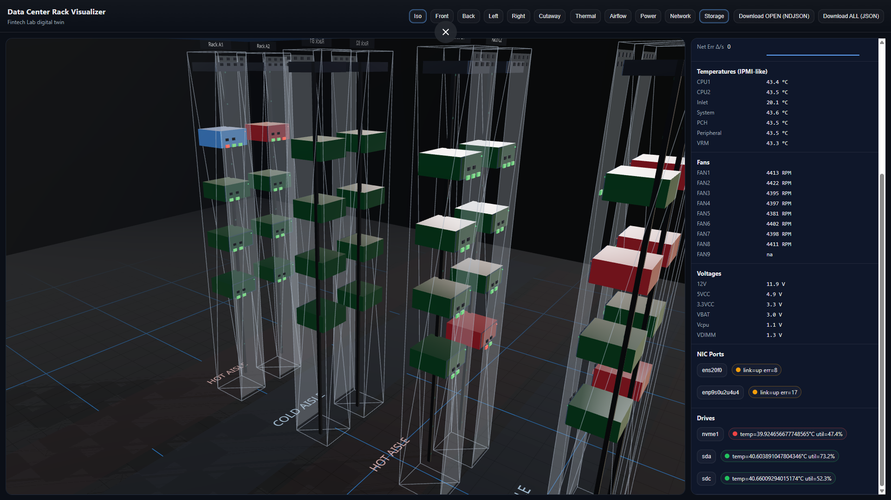
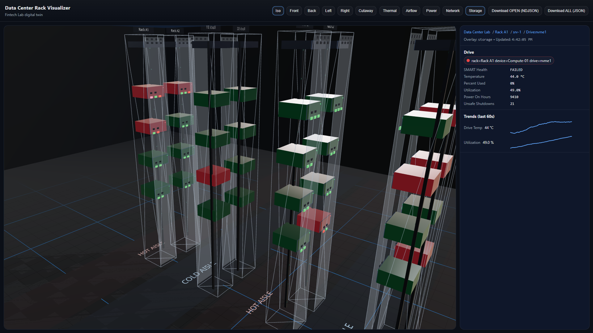

**Live Link to project Demo Visualization**
https://data-center-visualization-website.vercel.app/

## Members
Daniel Carpenter

Nicolas Salazar Sanchez

Adithya Raman

Sathya Mitiran Jayaprakash Suvithaa

# Report

## Demo images of the project

### Large screen devices view

The following image is an exmaple of a data center with 4 rows and 2 racks per row. Specifically we are showing the 'Thermal' view of the DC. 


You notice that some computing units are red, hence, you can easily click on them with the left panel rendering and see what is going on with them, showed in detail on the right panel as the following images show. 

 

We finally, click on the nvme1 Drive (since it's red), were we can see in the detail that the SMART health of the device has failed. 



## Motivation

Data centers form the backbone of modern computing infrastructure. From high frequency trading systems to search engines and large language models, nearly every large scale technology platform depends on reliable, high performance datacenter operations. These systems are often pushed close to their physical limits, which makes hardware faults, thermal issues, and network congestion inevitable.

Because failures can emerge and escalate quickly, operators need continuous visibility into system behavior. Having timely, easily interpretable data is critical for detecting abnormal conditions, diagnosing problems, and resolving issues before they impact performance or availability. This project aims to improve that visibility by presenting datacenter health in a clear and intuitive way.

## Overview

This project implements an interactive 3D visualization of a small datacenter, comparable in scale to the fintech lab. Users can freely navigate the space and inspect individual racks and machines, each of which displays real time (simulated) sensor data through time series plots.

System health is communicated visually using color coded indicators. For example, when a machine exceeds safe thermal or network thresholds, its color transitions from green to yellow or red, immediately signaling abnormal behavior. In addition to the 3D visualization, the project includes a separate Grafana based dashboard system that provides deeper insight into sensor data collected from within the datacenter. This dashboard combines Grafana with prometheus in order to get accurate real life updates off the stats and system health indicators.

## Datacenter visualization specifics

### 1) 3D datacenter visualization
- Racks are laid out in rows/aisles and rendered in an interactive 3D scene, even with rendered glass that's removable trhough the GUI.
- Each rack contains devices (servers/switches) and optional sub-components (drives/ports).
- The UI supports selecting racks/devices/ports/drives and inspecting details.

### 2) Telemetry simulation
- A background simulation loop updates telemetry every second:
  - **Power** (W) random-walks within device power budgets.
  - **Thermals** respond to power/inlet temperature.
  - **Fans** respond to CPU/ASIC temperature.
  - **Network** counters and errors increment over time.
  - **Drives** track temps/utilization and rare SMART failures.

### 3) Overlays + health/severity
It's possible to switch overlays that control what is emphasized in the scene (inspiration from the systems of the human body, as suggested by professor David L.):
- **Thermal**: device severity from max temperature thresholds.
- **Airflow**: severity from minimum fan RPM thresholds.
- **Power**: severity from power utilization vs. budget.
- **Network**: severity from link-down or error counts.
- **Storage**: severity from SMART failures, hot drives, or high utilization.

### 4) Event detection + incident log
The app detects transitions into problems and tracks them as incidents:
- “Open” events are generated when a device transitions into `warn` or `crit` (per domain).
- “Resolved” events are generated when the condition returns to normal.
- Incidents are deduplicated via an `incidentKey` and tracked in `openIncidents`.
- The log is persisted to `localStorage` so events survive a reload.

### 5) Exportable logs (JSON / NDJSON)
Two export modes are provided:
- **Download OPEN (NDJSON)**: exports only currently open incidents (one JSON object per line; log-ingestion-friendly).
- **Download ALL (JSON)**: exports the full historical event log as an array (good for audits/debugging).

---

## Project structure (key files)

- `src/App.tsx`  
  Main app layout. Starts/stops telemetry simulation on mount/unmount.

- `src/RackView3D.tsx`  
  The main 3D scene: room shell, aisles, racks, device meshes, labels, overlays, camera presets.

- `src/fakeData.ts`  
  Creates initial datacenter topology + generates and steps simulated telemetry.

- `src/store.ts`  
  Zustand store:
  - Holds topology, telemetry, selection state, overlay state, camera presets.
  - Maintains short-term metric history series for charts/inspection.
  - Maintains `eventLog` (append-only history) and `openIncidents` (current truth).
  - Runs the 1-second simulation loop and calls event detection.

- `src/eventDetection.ts`  
  Converts telemetry transitions into `EventLogEntry[]`:
  - Domain incidents: thermal/airflow/power/network/storage.
  - Port down/up events.
  - Drive SMART fail/recover events.
  Includes reconciliation logic for persisted incidents after reload.

- `src/LogExportButtons.tsx`  
  UI buttons for exporting logs (OPEN NDJSON / ALL JSON).

- `src/logExport.ts`  
  Browser download helper (`Blob` + anchor click) for exporting log files.

---

## Libraries used

### UI / State
- **React**  
  Component model, lifecycle (`useEffect`) to start/stop simulation.

- **Zustand**  
  Lightweight global state management (`useRackStore`) for:
  - telemetry state
  - selection state
  - event log + incidents
  - simulation loop control

### 3D rendering
- **three**  
  Core 3D math/geometry/materials.

- **@react-three/fiber**  
  React renderer for three.js (declarative 3D scene in JSX).

- **@react-three/drei**  
  Convenience helpers:
  - `OrbitControls` for camera orbiting
  - `Text` for labels
  - `Grid` for ground grid
  - `Environment` for lighting/reflections
  - `ContactShadows` for soft shadows

### Utility
- Browser `localStorage`  
  Persists event logs across refreshes.


## Project Goals and Future Developments

### Project Goals

**Intuitive Visual Representation**
The primary goal of this project is to represent a datacenter as a clear, interactive visual model. Complex physical components are abstracted into an easily understandable layout, allowing users to quickly assess the operational status of machines without requiring extensive hardware expertise.

**Interactive Exploration**
The tool is designed to support hands on exploration. Users can click on racks, servers, and other components to view detailed metrics, as well as zoom in and out of different areas of the datacenter. This level of interactivity enables faster identification of issues and supports more efficient root cause analysis in larger facilities.

**Accessibility and Usability**
The project balances visual appeal with practical performance. The interface is designed to be intuitive and visually clean while remaining usable across a wide range of devices. Since users may not always have access to high powered machines, the visualization is intended to run smoothly on more limited hardware without sacrificing clarity.

**Meaningful Data at Every Level**
Users should be able to observe system behavior at multiple levels of granularity, from individual drives to entire racks. Time series data allows users to identify trends, anticipate failures, and make informed decisions about maintenance or upgrades.

**Grafana dashboards and Metrics Infrastructure**
Grafana dashboards and Metrics Infrastructure
In addition to the 3D visuals, this project should include metrics monitoring built on Prometheus and Grafana. This is there to provide a greater level of detail and quantitative insight into the data center that should be left out of the visualization. The 3d visualization is better suited for rapid anomaly detection, whereas the Grafana dashboards serve as a main tool for in-depth analysis and trend identification

### Future Developments

One planned improvement is integrating live sensor data from the fintech lab, allowing the visualization to reflect real time system behavior rather than simulated data. This would enable continuous monitoring and more accurate detection of thermal, network, and hardware anomalies.

Another potential enhancement is embedding Grafana dashboards directly into the frontend. Currently, dashboards must be accessed separately and run locally. Integrating them into the main interface would create a more seamless workflow, allowing users to move from high level spatial insights to detailed metric analysis without leaving the application.

### Conclusion

Overall, this project served as a practical introduction to datacenter systems and the challenges involved in monitoring them. With many potential points of failure across hardware, thermal, and network components, having an intuitive tool to quickly navigate a datacenter and identify issues is increasingly valuable. By combining spatial visualization with system level metrics, this project demonstrates how interactive tools can improve observability and support more efficient datacenter operations.


# Run Instructions

## Visualization Tool

0. Prerequisites: 
- Node.js 18+ recommended
- npm (or yarn/pnpm)
1. Navigate to the `datacenter-render` directory, then into the `dc-rack-visualizer` folder.
2. Install dependencies by pasting the commands from the README located in the **`datacenter-render` folder** (not the one inside `dc-rack-visualizer`). Those being: 
   ```bash
   npm i
   npm i three @react-three/fiber @react-three/drei zustand
   ```
    
3. Run the following command:

   ```bash
   npm run dev
   ```
4. Open your browser and visit:

   ```
   http://localhost:5173/
   ```
5. The project is also available at: https://data-center-visualization-website.vercel.app/

---

## Grafana Dashboards and API

1. Ensure Docker is running on your machine.
2. Navigate to the `datacenter-control` directory.
3. Start the services with:

   ```bash
   docker compose up -d
   ```

   This will launch three containers:

   * Prometheus
   * API service
   * Grafana
4. To view the Grafana dashboards, open:

   ```
   http://localhost:3000/
   ```

   Then select **Dashboards** from the left-hand menu.
5. You should see the cooling, power, and thermal dashboards, with data updating every 30 seconds.
